FFmate is an automation layer built on top of [FFmpeg](https://ffmpeg.org/), designed not only to simplify transcoding but also to serve as an **extensible engine for custom media workflows**. It provides developers with the tools to integrate FFmpeg's power into their applications and services through a comprehensive REST API, event-driven webhooks, and scriptable pre/post-processing hooks.

If you're looking to build custom media processing pipelines, integrate transcoding into your existing systems, or develop tools that leverage FFmpeg, FFmate provides the foundation.

## ✨ Core Features for Extensibility

FFmate is built with extensibility in mind. Here's how you can leverage its core components:

- **REST API** – Submit and manage FFmpeg tasks programmatically  
- **Web UI** – Monitor and control jobs in real time, no terminal required  
- **Watchfolders** – Automatically process files dropped into a directory  
- **Presets** – Ready-made set of pre-configured transcoding presets for common use cases  
- **Webhooks** – Get real-time notifications for task events  
- **Dynamic Wildcards** – Automate file naming and folder structures  
- **Pre/Post Processing** – Run custom scripts before or after each task to automate complex workflow steps
- **Built-in Queue** – Manage task execution with priority control and smart concurrency handling

## 🚀 Getting Started for Developers

To start extending, integrating with, or contributing to FFmate:

### Prerequisites

*   **FFmpeg:** Installed and in `$PATH`.
*   **Go (Golang):** Version 1.24+ (or specify your project's minimum version). Required for building from source or contributing to core.
*   **Git:** For cloning the repository.
*   Familiarity with REST APIs and JSON.
*   Your preferred scripting language (Python, Bash, Node.js, etc.) for pre/post-processing scripts.

### Installation & Setup

You have two main options:

1.  **Use Pre-compiled Binaries (for integration/extension):**
    *   Download the latest binary from [GitHub Releases](https://github.com/welovemedia/ffmate/releases).
    *   Make executable: `chmod +x ffmate`
    *   (Optional) Move to a directory in your `$PATH`.
    *   Run FFmate Server: `./ffmate server`

2.  **Build from Source (for core contribution/deep customization):**
    *   **Clone the repository:**
        ```bash
        git clone https://github.com/welovemedia/ffmate.git
        cd ffmate
        ```
    *   **Install Go dependencies:**
        ```bash
        go mod tidy
        # or go get ./...
        ```
    *   **Build the FFmate binary:**
        ```bash
        go build -o ffmate main.go
        ```
        The compiled `ffmate` binary will be in the root of the `ffmate` directory.
    *   **Run FFmate Server:**
        ```bash
        ./ffmate server
        # For development, consider enabling debug for relevant namespaces:
        # ./ffmate server --debug="api:webhook:queue:ffmpeg:sev"
        ```

The API will be available at `http://localhost:3000`.

### Key Extension Points - Quick Reference

*   **Integrating with an existing application?**
    *   Start with the `/api/v1/tasks` endpoint to submit jobs.
    *   Use `/api/v1/webhooks` to get status updates back to your application.
*   **Need custom logic around transcoding?**
    *   Implement pre/post-processing scripts.
    *   Define `scriptPath` and `sidecarPath` in your task/preset API calls.
*   **Building a custom dashboard or UI?**
    *   The entire Web UI is built on the public REST API and WebSockets. You can do the same!
    *   WebSockets (served from `/ws` on the same port) provide real-time updates for tasks and logs.
*   **Automating complex ingestion workflows?**
    *   Use the `/api/v1/watchfolders` endpoint combined with presets that trigger your custom processing logic.

## 🔧 Understanding FFmate Internals & Code Structure

FFmate is a Go application. A high-level overview of its structure and key components for extension:

**Conceptual Diagram:**

```mermaid
graph TD
    %% ─── UI & API ─────────────────────────
    YourApp["Your Application / Script"] -- REST API --> REST_API["FFmate REST API (Gin)"]
    WebUI["FFmate Web UI (Vue/React/Static)"] -- REST API / WebSockets --> REST_API

    %% ─── Services (single row) ───────────
    subgraph FFmate_Services ["Services Layer (./internal/services)"]
        direction LR
        TaskSvc["Task Service"]
        PresetSvc["Preset Service"]
        WatchfolderSvc["Watchfolder Service"]
        WebhookSvc["Webhook Service"]
    end
    REST_API --> TaskSvc
    REST_API --> PresetSvc
    REST_API --> WatchfolderSvc
    REST_API --> WebhookSvc

    %% ─── Core & DB side-by-side ───────────
    subgraph FFmate_Core ["Core Logic (./internal/core, ./internal/ffmpeg)"]
        direction LR
        Queue["Task Queue Processor"]
        PrePostScripts["Pre/Post-Processing Engine"]
        DB[(SQLite DB - GORM)]
    end
    TaskSvc --> Queue
    Queue --> PrePostScripts
    PrePostScripts --> FFMpegBinary["ffmpeg Binary Wrapper"]
    Queue --> DB
    WebhookSvc -- Event Bus/Direct Call --> YourAppWebhook["Your Webhook Endpoint"]

    FFMpegBinary -- system call --> ActualFFmpeg["ffmpeg (External Binary)"]


    %% ─── Styling ───────────
    style YourApp fill:#e6ffe6,stroke:#009933,stroke-width:1.5px,color:#000;
    style YourAppWebhook fill:#e6ffe6,stroke:#009933,stroke-width:1.5px,color:#000;
    classDef ui     fill:#99d6ff,stroke:#2060a0,stroke-width:1.2px,color:#000000;
    classDef api    fill:#b3e0ff,stroke:#2060a0,stroke-width:1.2px,color:#000000;
    classDef svc    fill:#bdb4ff,stroke:#4b44a0,stroke-width:1.2px,color:#000000;
    classDef core   fill:#99ff99,stroke:#2d7a2d,stroke-width:1.2px,color:#000000;
    classDef db     fill:#ffcc80,stroke:#b36b00,stroke-width:1.2px,color:#000000;
    classDef ffbin  fill:#ff99cc,stroke:#b3366b,stroke-width:1.2px,color:#000000;
```


** Code Structure (illustrative):**

*   **`main.go`**: Main application entry point, CLI command parsing (using Cobra), server initialization.
*   **`/internal/`**: Core application logic, not intended for direct import by other projects.
    *   **`/controller/`**: HTTP request handlers (e.g., using Gin). This is where API routes are defined and map to services.
    *   **`/services/`**: Business logic for each major feature (Tasks, Presets, Watchfolders, Webhooks). Services orchestrate operations, interact with the database, and call core components.
    *   **`/dto/`**: A folder holding all Data Transfer Objects.
    *   **`/queue/`**: Manages the task queue, concurrency, and task lifecycle.
    *   **`/interceptor/`**: Interceptors to use with Gin for various routes.
    *   **`/middleware/`**: Global middleware being used by Gin.
    *   **`/metrics/`**: Manages and exposes prometheus metrics for later scraping.
    *   **`/ffmpeg/`**: Wrapper around the `ffmpeg` binary, responsible for executing commands, parsing progress, and handling output/errors.
    *   **`/database/`**: Database models/structs (e.g., for GORM if used) and database interaction logic (repository pattern).
    *   **`/config/`**: Application configuration management.
    *   **`/utils/`**: Common utility functions.
*   **`/pkg/`**: Libraries intended to be used by external applications (if any). (Your current docs don't suggest FFmate is used as a library itself, mostly as a standalone server).
*   **`/ui/`** or **`/web/dist/`**: Contains the pre-built static assets for the Web UI.
*   **`/docs/`**: Your Markdown documentation.
*   **`go.mod`, `go.sum`**: Go module files.

**Key Extension & Contribution Areas:**

*   **API Handlers (`/internal/controller/`):** Extend existing API endpoints or add new ones.
*   **Services (`/internal/services/`):** Modify or add business logic for features.
*   **Core Logic (`/internal/ffmpeg/`):** Enhance task processing, FFmpeg interaction, or pre/post-script handling.
*   **Web UI (`/ui/`):** The ffmate-ui repository as submodule.

## 📚 Product Documentation

Want to dive deeper into FFmate? The documentation covers everything—from API usage to Web UI features and real-world examples 👉 Everything you need is now available at [https://docs.ffmate.io](https://docs.ffmate.io)


## 🤝 Contributing to FFmate Core

Interested in contributing directly to FFmate's development? We welcome contributions!

1.  **Understand the Project:** Familiarize yourself with the existing documentation and code structure (see "Understanding FFmate Internals & Code Structure" above).
2.  **Setup your Environment:** Ensure you have Go (see prerequisites) and Git installed.
3.  **Find an Issue or Propose an Enhancement:** Check existing [GitHub Issues](https://github.com/welovemedia/ffmate/issues) or discuss your ideas on Discord first.
4.  **Fork the Project.**
5.  **Clone your fork and build from source** (see "Build from Source" instructions above).
6.  **Create your Feature Branch:** (`git checkout -b feature/YourAmazingFeature`).
7.  **Write Code & Tests:** Implement your feature or fix. Add unit tests where appropriate.
8.  **Ensure Code Quality:**
    *   Run `go fmt ./...` to format your code.
    *   Run `go vet ./...` to check for suspicious constructs.
    *   (If linters like `golangci-lint` are used, run them).
9.  **Commit your Changes:** (`git commit -m 'feat: Add YourAmazingFeature'`). Follow conventional commit messages if applicable.
10. **Push to the Branch:** (`git push origin feature/YourAmazingFeature`).
11. **Open a Pull Request** against the `main` (or `develop`) branch of the original `welovemedia/ffmate` repository. Provide a clear description of your changes.

## 💬 Developer Community & Support

*   **Discord (Developer Chat):** Join our [FFmate Community on Discord](https://discord.gg/ef6gQGr2) for discussions on extending FFmate, asking technical questions, and sharing your projects.
*   **GitHub Issues:** Report bugs, discuss potential enhancements [GitHub Issues](https://github.com/welovemedia/ffmate/issues).

## 📄 License

This project is licensed under the **Server Side Public License (SSPL), Version 1**. See the [LICENSE](LICENSE) file for full details.